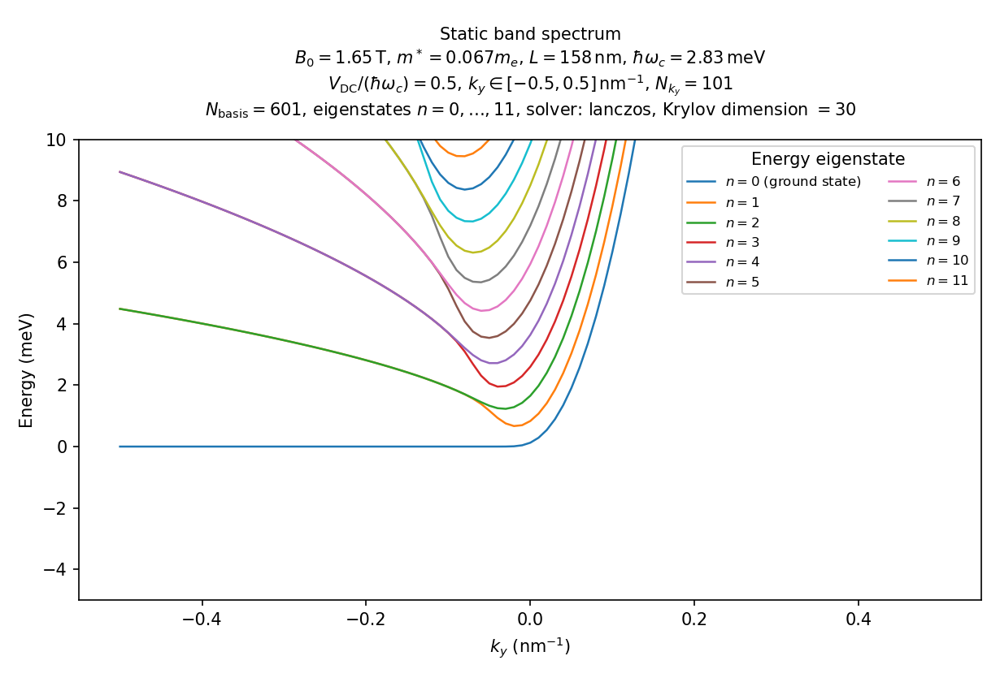
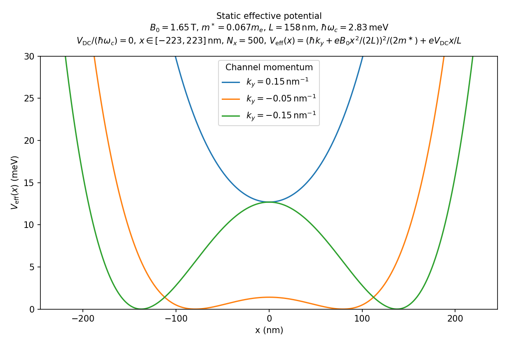
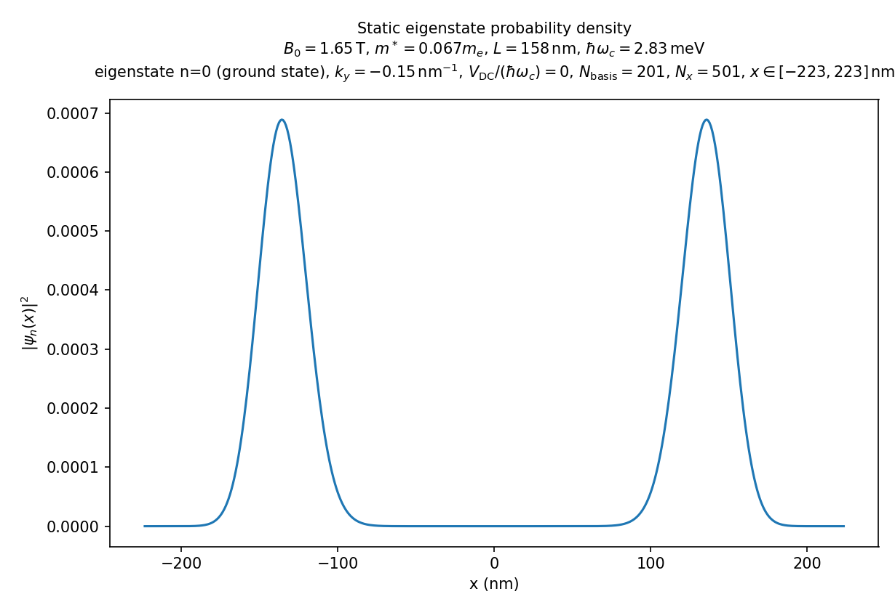
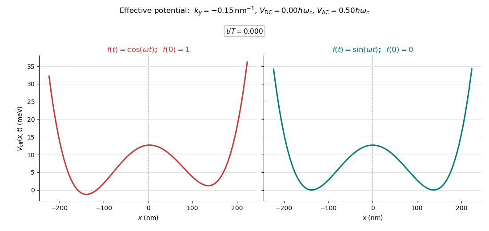
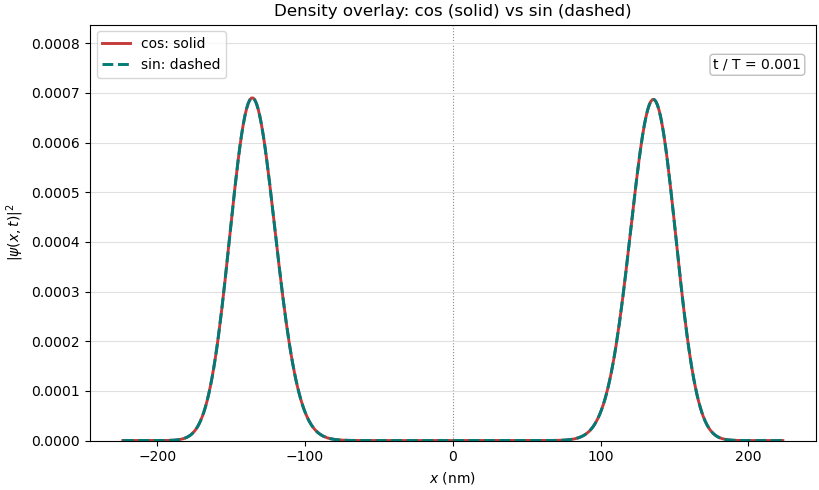
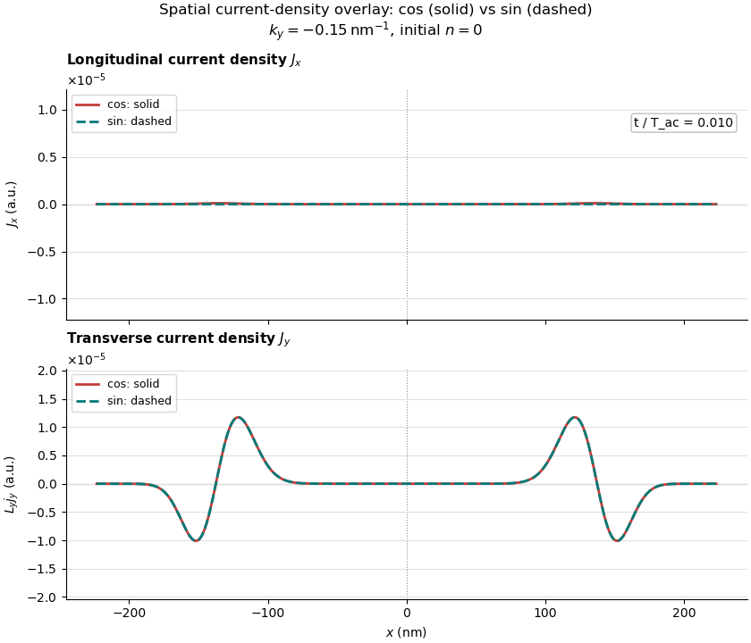

# 2DEG in a linearly nonuniform magnetic field

This repository solves a **single-electron** two-dimensional electron-gas
(2DEG) model in a magnetic field that varies linearly across the sample. It
calculates stationary spectra and eigenstates, then propagates one selected
static eigenstate under sinusoidal or cosine electric driving.

All internal calculations use Hartree atomic units unless a label explicitly
says nm, meV, or T. The model excludes spin, Zeeman coupling,
electron--electron interaction, disorder, confinement in $y$, and a sum over
occupied $k_y$ channels.

## Repository layout

- **src/** — physical-model code shared by both calculations: SHO operator
  matrices (`basis.py`), Hamiltonian and effective-potential assembly
  (`hamiltonian.py`), the ARPACK/`expm_multiply` eigensolver and
  exponential-action wrappers (`lanczos.py`), the commutator-free
  $\Upsilon^{[6]}_3$ time-stepper (`propagators.py`), and the shared
  zero-based state-index convention (`state_index.py`).
- **statics/** — the DC-only spectrum, wavefunction, and potential
  calculations described in Section 2, following the same
  calculate-and-save/plot-from-saved-data split as `dynamics/`. Calculation
  stages: `spectrum.py`, `wave_function.py`, `potential.py`; plotting stages:
  `plot_spectrum.py`, `plot_wave_function.py`, `plot_potential.py`;
  parameters live in `config.py`.
- **dynamics/** — the driven trajectory/current/density pipeline, including
  the time-dependent effective potential, described in Sections 3, 5, and 6.
  Entry points: `dynamics.py` (trajectory), `current_density.py` /
  `plot_current_density.py` (spatial line current density $J_x(x,t),J_y(x,t)$),
  `current.py` / `plot_current.py` ($x$-integrated diagnostics $I_x(t)$ and
  $I_y(t)/L_y$, computed from the current-density file — neither is an
  absolute current; see Section 5), `density.py` / `plot_density.py`,
  `potential_comparison.py`; parameters live in `config.py`.
- **data/statics/**, **data/dynamics/** — saved HDF5 calculation results:
  static spectra/wavefunctions/potentials, and driven trajectories with
  derived current/density data (Sections 2 and 5).
- **figures/statics/**, **figures/dynamics/** — PNGs and GIFs produced by the
  two pipelines.
- **non_BTD.md** — a longer derivation of the gauge choice, well structure,
  propagator, and current formula (Marp slide source).
- **method.pdf** and the other PDFs at the repository root — background
  papers; see References at the end of this document.

## 1. Physical model: full Hamiltonian

The electron has charge $q=-e$, where $e>0$. The code parameter
**ELEMENTARY_CHARGE** means the positive magnitude $e=1$; do not set it to
$-1$.

The prescribed fields and gauge are

$$
\mathbf B(x)=\frac{B_0x}{L}\hat{\mathbf z},\qquad
\mathbf A(x)=A_y(x)\hat{\mathbf y}
=\frac{B_0x^2}{2L}\hat{\mathbf y},
$$

$$
\phi(x,t)=-\frac{V_e(t)}{L}x,\qquad
V_e(t)=V_{\rm DC}+V_{\rm AC}f(\omega_{\rm ac}t).
$$

Thus $\partial_xA_y=B_0x/L$ and $-\partial_x\phi=V_e(t)/L$. The full
two-dimensional single-particle Hamiltonian is

$$
\boxed{
H(t)=\frac{1}{2m^\ast}
\left[
p_x^2+
\left(p_y+\frac{eB_0x^2}{2L}\right)^2
\right]
+\frac{eV_e(t)}{L}x .
}
$$

The electric term has a **plus** sign because
$q\phi=(-e)(-V_ex/L)=+eV_ex/L$.

Since $[H,p_y]=0$, write

$$
\Psi(x,y,t)=\frac{e^{ik_yy}}{\sqrt{L_y}}\psi_{k_y}(x,t),
\qquad p_y\Psi=\hbar k_y\Psi .
$$

Each fixed-$k_y$ channel obeys

$$
i\hbar\partial_t\psi_{k_y}(x,t)=H_{k_y}(t)\psi_{k_y}(x,t),
$$

$$
\boxed{
H_{k_y}(t)=\frac{p_x^2}{2m^\ast}
+\frac{1}{2m^\ast}
\left(\hbar k_y+\frac{eB_0x^2}{2L}\right)^2
+\frac{e}{L}[V_{\rm DC}+V_{\rm AC}f(\omega_{\rm ac}t)]x .
}
$$

The polynomial form represented in the SHO basis is

$$
\begin{aligned}
H_{k_y}(t)={}&\frac{p_x^2}{2m^\ast}
+\frac{\hbar^2k_y^2}{2m^\ast}I
+\frac{\hbar k_y eB_0}{2m^\ast{}L}x^2\\
&+\frac{e^2B_0^2}{8m^\ast{}L^2}x^4
+\frac{e}{L}[V_{\rm DC}+V_{\rm AC}f(\omega_{\rm ac}t)]x .
\end{aligned}
$$

At zero electric bias, positive $k_y$ gives one central well; negative $k_y$
gives two classical minima. A DC field tilts the wells.

## 2. Static calculation

The static calculation contains the DC bias but no AC field:

$$
\boxed{
H_{\rm static}(k_y;V_{\rm DC})=
\frac{p_x^2}{2m^\ast}
+\frac{1}{2m^\ast}
\left(\hbar k_y+\frac{eB_0x^2}{2L}\right)^2
+\frac{eV_{\rm DC}}{L}x .
}
$$

It solves

$$
H_{\rm static}(k_y;V_{\rm DC})\phi_n(x)=E_n\phi_n(x),
\qquad E_0\le E_1\le\cdots .
$$

Here $n=0$ is the ground state and $n=1$ is the first excited state.

### Static numerical method

The state is represented in $N$ harmonic-oscillator (SHO) functions:

$$
\phi_n(x)\simeq\sum_{j=0}^{N-1}c^{(n)}_j\varphi_j(x).
$$

The code constructs analytic matrices for $x$, $x^2$, $x^4$, and $p_x^2$.
This is a Galerkin truncation on the whole real line. The $x$ grid used for
figures only reconstructs wavefunctions; it is not a hard boundary.

For spectrum sweeps, **SPECTRUM_SOLVER** selects full Hermitian
diagonalization (dense) or ARPACK's low-energy eigensolver (lanczos).
**LANCZOS_DIMENSION** is only the ARPACK working-subspace size, ncv.
Static wavefunction figures use dense diagonalization.

### Saved static data

Like the dynamic pipeline, each static calculation is a two-stage,
file-based process: a `statics/spectrum.py`, `wave_function.py`, or
`potential.py` run calculates the configured result once and saves it to an
HDF5 file under `data/statics/`; a separate `plot_spectrum.py`,
`plot_wave_function.py`, or `plot_potential.py` run only reads that file and
renders the figure. Plotting never recomputes silently — a missing or
mismatched data file stops with an instruction naming the calculation script
to run first. Each `run_*.py` convenience script in Section 6 just chains
both stages for one command. `--force` on either stage replaces its file
after a deliberate configuration change; `data/statics/` and
`figures/statics/` file names are both derived from every setting that
affects the run, so a changed configuration produces new files rather than
silently overwriting old ones.

### Example static figures

Static spectrum: $V_{\rm DC}=0.5\hbar\omega_c$, 101 $k_y$ points, 601 SHO
states, and the lowest 12 eigenstates:



Static effective potentials at zero DC bias:



Static ground-state density, $k_y=-0.15\ {\rm nm}^{-1}$ and $n=0$:



## 3. Driven calculation and initial state

The propagation Hamiltonian is

$$
\boxed{
H_{k_y}(t)=H_{\rm static}(k_y;V_{\rm DC})
+\frac{eV_{\rm AC}}{L}x f(\omega_{\rm ac}t).
}
$$

The initial state is prepared from the **DC-only** static problem:

$$
\boxed{
H_{\rm static}(k_y;V_{\rm DC})\phi_n=E_n\phi_n,\qquad
\psi_{k_y}(x,0)=\phi_n(x).
}
$$

Here $n$ is the config parameter **INITIAL_STATE_INDEX**. The checked-in
configuration currently has **INITIAL_STATE_INDEX = 0**, hence

$$
\psi_{k_y}(x,0)=\phi_0(x),
$$

the ground-state eigenstate of $H_{\rm static}(V_{\rm DC})$. The AC term is
excluded while preparing $\phi_n$.

| **AC_WAVEFORM** | $f(\omega_{\rm ac}t)$ | $H(t=0)$ | Meaning |
|---|---:|---|---|
| sin | $\sin(\omega_{\rm ac}t)$ | $H_{\rm static}$ | Continuous turn-on |
| cos | $\cos(\omega_{\rm ac}t)$ | $H_{\rm static}+eV_{\rm AC}x/L$ | Quench of the same prepared $\phi_n$ |

The driven equation is

$$
i\hbar\partial_t\psi_{k_y}(x,t)=H_{k_y}(t)\psi_{k_y}(x,t).
$$

The code uses the five-exponential, fully commutator-free sixth-order
$\Upsilon^{[6]}_3$ (Y6_3) method. It samples the potential at three
sixth-order Gauss--Legendre nodes per step. Matrix exponential actions use
SciPy **expm_multiply**, which internally uses adaptive scaling and truncated
Taylor series; it is not a user-controlled Lanczos exponential.

### Saved trajectory data

Each completed driven propagation is saved once as an HDF5 file:

```
data/dynamics/trajectory_RUN_TAG.h5
```

The file contains the complex SHO coefficient array
$c_j(t_i)$ in the dataset **states_sho_coefficients**, the atomic-unit time
axis in **times_au**, and JSON metadata containing every physical and numerical
parameter used in the run. The saved snapshots are at
$t_i=\Delta t,2\Delta t,\ldots,T$ (config parameter **TOTAL_TIME**), matching
the propagator's existing output convention. The density and current
calculation stages read this file; they never start a propagation implicitly.

The public dynamic-data pipeline has one wavefunction stage and two
independent observable branches:

~~~text
dynamics.py  →  trajectory_RUN_TAG.h5
                    ├→ density.py         → density_RUN_TAG_Nx....h5         → plot_density.py
                    └→ current_density.py → current_density_RUN_TAG_Nx....h5 → plot_current_density.py
                                                          └→ current.py      → current_RUN_TAG_Nx....h5 → plot_current.py
~~~

### Dynamic initial-state solver

Before propagation, the selected $\phi_n$ is obtained from
$H_{\rm static}$.  At exactly $V_{\rm DC}=0$ the code uses dense Hermitian
diagonalization to preserve parity in the near-degenerate tunnel doublets.
For $V_{\rm DC}\ne0$, ARPACK obtains the requested low state(s).
**INITIAL_EIGSH_NCV** is that ARPACK solve's ncv working-subspace size; it
affects neither the zero-bias dense solve nor SciPy **expm_multiply**.

| Parameter | Controls | Does not control |
|---|---|---|
| **INITIAL_EIGSH_NCV** | ARPACK convergence of $\phi_n$ when $V_{\rm DC}\ne0$ | Zero-bias dense solve; dynamic exponential actions |
| **NUMBER_OF_STEPS** | $\Delta t$ and sixth-order time error | Static initial eigenpair accuracy |

### Static vs. driven effective potential

This GIF (produced by `dynamics/potential_comparison.py`) compares
**Hamiltonians only**, not propagated wavefunctions. Left/red is cosine and
right/teal is sine, both evaluated at the same time:

$$
V_e^{\cos}(t)=V_{\rm DC}+V_{\rm AC}\cos(\omega_{\rm ac}t),\qquad
V_e^{\sin}(t)=V_{\rm DC}+V_{\rm AC}\sin(\omega_{\rm ac}t).
$$

At $t=0$, cosine has $f(0)=1$ and sine has $f(0)=0$: cosine's frame starts
already at the quenched double well described above, while sine's frame
starts at the plain $H_{\rm static}$.



## 4. Configuration parameters

Edit **dynamics/config.py** for dynamic calculations and
**statics/config.py** for static figures. Shared material parameters are
currently duplicated; keep them identical for a consistent comparison.

### Shared physical parameters

| Code parameter | Meaning | Current value |
|---|---|---:|
| **HBAR** | Reduced Planck constant | $1$ a.u. |
| **ELEMENTARY_CHARGE** | Positive charge magnitude $e$ | $1$ a.u. |
| **EFFECTIVE_MASS** | Effective mass $m^\ast$ | $0.067m_e$ |
| **MAGNETIC_FIELD** | Field scale $B_0$ | $1.65$ T |
| **CYCLOTRON_FREQUENCY** | $\omega_c=eB_0/m^\ast$ | $1.0479517\times10^{-4}$ a.u. |
| **MAGNETIC_LENGTH_SCALE** | Gradient length $L$ | $2985.14$ bohr $=157.91$ nm |
| **AU_TO_MEV** | Hartree-to-meV display conversion | $2.7\times10^4$ |
| **AU_TO_NM** | bohr-to-nm display conversion | $5.29\times10^{-2}$ |

The two conversion factors are rounded display constants.

### Current dynamic configuration: dynamics/config.py

| Parameter | Meaning | Current value |
|---|---|---:|
| **BASIS_SIZE** | SHO basis size $N$ | $501$ |
| **KY** | Conserved channel wave vector $k_y$ | $-0.15\ {\rm nm}^{-1}$ |
| **V_DC** | Static potential drop | $0$ |
| **V_AC** | AC potential-drop amplitude | $0.5\hbar\omega_c$ |
| **AC_FREQUENCY** | Drive angular frequency $\omega_{\rm ac}$ | $\omega_c$ |
| **AC_WAVEFORM** | Drive waveform | sin |
| **INITIAL_STATE_INDEX** | Prepared static state | $0$ ($\phi_0$) |
| **INITIAL_EIGSH_NCV** | ARPACK ncv for $V_{\rm DC}\ne0$ initialization | $30$ |
| **TOTAL_TIME** | Propagation duration | $10(2\pi/\omega_c)$ |
| **NUMBER_OF_STEPS** | Number of Y6_3 steps | $1000$ |
| **SPATIAL_GRID_POINTS** | Reconstruction grid points | $401$ |

The default time increment is

$$
\Delta t=\frac{T}{N_t}
=\frac{2\pi/\omega_c}{100},
$$

where $T$ is **TOTAL_TIME** and $N_t$ is **NUMBER_OF_STEPS**.

### Current static-figure configuration: statics/config.py

| Figure | Parameters |
|---|---|
| Spectrum | $k_y\in[-0.5,0.5]\ {\rm nm}^{-1}$, 101 points, $V_{\rm DC}=0.5\hbar\omega_c$, 601 SHO states, lowest 12 states, lanczos ncv $=30$ |
| Wavefunction | $k_y=-0.15\ {\rm nm}^{-1}$, $V_{\rm DC}=0$, $n=0$, 201 SHO states |
| Potential | $V_{\rm DC}=0$, three configured $k_y$ values, 500 $x$ points |

## 5. Current observable

For a channel normalized along $x$ ($\int|\psi(x,t)|^2dx=1$), the local line
current density is

$$
J_x(x,t)=-\frac{e\hbar}{m^\ast}
{\rm Im}[\psi^\ast(x,t)\partial_x\psi(x,t)],
$$

$$
J_y(x,t)=-\frac{e}{m^\ast}
\left(\hbar k_y+\frac{eB_0x^2}{2L}\right)|\psi(x,t)|^2.
$$

The vector-potential contribution in $J_y$ is required for the mechanical
current.

These two components are **not** on equal footing, and neither $x$-integral
below is an absolute current in amperes for a specific device. Write the
full wavefunction as $\Psi(x,y,t)=\psi(x,t)e^{ik_yy}/\sqrt{L_y}$, so the
properly normalized 2D charge current density is $J_x(x,t)/L_y$ and
$J_y(x,t)/L_y$ (this repository never introduces $L_y$ as an actual number;
see the model exclusions in the introduction — no sum over occupied $k_y$
channels).

- **$J_x$:** integrating the 2D density over the periodic $y$ direction
  reintroduces exactly one factor of $L_y$ ($\int_0^{L_y}\!dy\,J_x/L_y=J_x$),
  so $J_x(x,t)$ is *already* a well-defined, $L_y$-independent current
  crossing position $x$ (it also satisfies the 1D continuity equation
  $\partial_t(-e|\psi|^2)+\partial_xJ_x=0$). Integrating it again over $x$,

  $$
  I_x(t)=\int J_x(x,t)\,dx,
  $$

  sums together current values at *different* positions and is **not** a
  new physical quantity. It is kept only because it was already used as a
  diagnostic comparison scalar.

- **$J_y$:** there is no such cancellation. $J_y(x,t)$ is a genuine linear
  density in $x$, and

  $$
  \frac{I_y(t)}{L_y}=\int J_y(x,t)\,dx
  $$

  is the transverse current **per unit channel length $L_y$** — i.e. its
  value at $L_y=1$ a.u. — not the absolute transverse current $I_y(t)$
  itself. Getting an absolute, $L_y$-independent current would require
  summing over the occupied $k_y$ Fermi sea (excluded by this model), where
  the $1/L_y$ here cancels against the $L_y$ in the $k_y$ density of states.

### Saved current-density data

**dynamics/current_density.py** is stage 2 of the pipeline. It reads the
saved trajectory, reconstructs $\psi$ and $\partial_x\psi$, calculates
$J_x(x,t)$ and $J_y(x,t)$, and saves

```
data/dynamics/current_density_RUN_TAG_Nx....h5
```

This HDF5 file contains **x_au**, **times_au**, **jx_au**, **jy_au**, and
metadata linking it to the exact trajectory and spatial grid. It does not
rerun time propagation. **dynamics/plot_current_density.py** is stage 3: it
only reads the current-density HDF5 file and writes the GIF.

### Saved current data ($x$-integrated; not an absolute current)

**dynamics/current.py** is stage 3 of the pipeline (parallel to
`plot_current_density.py`, both reading the same current-density file). It
reads a saved current-density HDF5 file — the configured one by default, or
any explicitly named file, including one produced by an older
`current_density.py` run — integrates $J_x$ and $J_y$ over $x$, and saves

```
data/dynamics/current_RUN_TAG_Nx....h5
```

This HDF5 file contains **times_au**, **ix_au**, **iy_per_ly_au**, and
metadata linking it to the exact current-density file (and, transitively,
the trajectory). It never reconstructs $\psi$ itself. The dataset is
deliberately named **iy_per_ly_au**, not "iy_au", as a standing reminder
that it is $I_y(t)/L_y$, not $I_y(t)$ — see Section 5. **dynamics/plot_current.py**
is stage 4: it only reads this file and plots $I_x(t)$ (diagnostic only) and
$I_y(t)/L_y$ as a PNG (there is no spatial axis left to animate).

### Saved density data

**dynamics/density.py** is the density branch. It reads the trajectory,
reconstructs $|\psi(x,t)|^2$, and saves

```
data/dynamics/density_RUN_TAG_Nx....h5
```

Its datasets are **x_au**, **times_au**, and **density_au**, with the same
parameter and grid provenance checks as current-density data. **dynamics/plot_density.py**
only reads this density HDF5 file and writes the density GIF.

### Dynamic HDF5 file contract

The dynamic stages deliberately use files, rather than an in-memory chain.
This means a completed trajectory can be post-processed again after changing
the active configuration, without repeating propagation.

| File type | Created by | Required input for | Main datasets |
|---|---|---|---|
| `trajectory_*.h5` | `dynamics.py` | `current_density.py`, `density.py` | `states_sho_coefficients`, `times_au` |
| `current_density_*.h5` | `current_density.py` | `plot_current_density.py`, `current.py` | `x_au`, `times_au`, `jx_au`, `jy_au` |
| `current_*.h5` | `current.py` | `plot_current.py` | `times_au`, `ix_au`, `iy_per_ly_au` |
| `density_*.h5` | `density.py` | `plot_density.py` | `x_au`, `times_au`, `density_au` |

Every file also stores JSON metadata.  `current_density.py` and `density.py`
take the basis size, $m^\ast$, $B_0$, $L$, $k_y$, and drive settings from the
selected **trajectory** metadata; `current.py` takes its provenance from the
selected **current-density** metadata.  They therefore do not silently use a
different current value of `config.py`.  The two-file comparison modes
require matching physics, numerical parameters, and $x,t$ grids; only
`AC_WAVEFORM` may differ.

## 6. Dynamic workflow and commands

Run from the repository root:

~~~bash
python -m pip install numpy scipy matplotlib pillow h5py

# Stage 1: calculate the wavefunction trajectory once from dynamics/config.py.
python -m dynamics.dynamics

# Stage 2: derive and save the spatial line current density Jx(x,t), Jy(x,t)
# from that trajectory.
python -m dynamics.current_density

# Stage 2: independently derive and save |psi(x,t)|^2 from that trajectory.
python -m dynamics.density

# Stage 3: integrate Jx, Jy over x from the current-density file above;
# never reconstructs psi itself. Ix(t) is diagnostic only; Iy(t) here is
# really Iy(t)/Ly (per unit channel length), not an absolute current --
# see Section 5.
python -m dynamics.current

# Stage 3/4: draw GIFs/PNGs; no wavefunction or observable is recalculated.
python -m dynamics.plot_current_density   # GIF of Jx(x,t), Jy(x,t)
python -m dynamics.plot_current           # PNG of Ix(t), Iy(t)/Ly
python -m dynamics.plot_density

# Force a replacement only after deliberately changing a parameter.
python -m dynamics.dynamics --force
python -m dynamics.current_density --force
python -m dynamics.current --force
python -m dynamics.density --force

# Potential comparison animation (dynamics).
python -m dynamics.potential_comparison

# Independent static calculations, following the same two-stage pattern as
# dynamics: stage 1 calculates (or reuses) the HDF5 data under data/statics/;
# stage 2 only reads that file and plots it. Pass --force to stage 1 to
# replace stale saved data after a config.py change.
python -m statics.spectrum          # stage 1: calculate and save
python -m statics.plot_spectrum     # stage 2: plot from saved data only
python -m statics.wave_function
python -m statics.plot_wave_function
python -m statics.potential
python -m statics.plot_potential
~~~

The equivalent direct commands are available after `cd dynamics`:
`python dynamics.py`, `python current_density.py`, `python current.py`,
`python density.py`, `python plot_current_density.py`,
`python plot_current.py`, and `python plot_density.py`. Likewise after
`cd statics`: `python spectrum.py`, `python plot_spectrum.py`, and the
`wave_function`/`potential` equivalents.

### Process any saved trajectory or observable file

The default commands above use the file names implied by the current
**dynamics/config.py**.  To process an already saved run, pass the input file
explicitly.  Its HDF5 metadata supplies the basis size and all physical
parameters, so it is safe to process a cosine trajectory even when the active
configuration is currently sine (or vice versa).  No propagation is started.

For example, from the repository root:

~~~bash
TRAJECTORY=data/dynamics/trajectory_y6_3_cos_kym0p15nm1_Vdc0hwc_Vac0p5hwc_w1wc_n0_Nbasis501_Nt1000_T10periods.h5

# Stage 2: no propagation.  The default is Nx=SPATIAL_GRID_POINTS (currently 401).
python -m dynamics.current_density "$TRAJECTORY"
python -m dynamics.density "$TRAJECTORY"

# --nx controls only the real-space reconstruction grid, not the SHO basis
# or the propagated wavefunction.  --output selects an explicit destination.
python -m dynamics.current_density "$TRAJECTORY" --nx 801 \
  --output data/dynamics/current_density_cos_n0_Nx801.h5
python -m dynamics.density "$TRAJECTORY" --nx 801 \
  --output data/dynamics/density_cos_n0_Nx801.h5

# Stage 3: integrate the current density over x; no wavefunction reconstruction.
python -m dynamics.current data/dynamics/current_density_cos_n0_Nx801.h5 \
  --output data/dynamics/current_cos_n0_Nx801.h5

# Stage 3/4: only read observable data and render a GIF/PNG.
python -m dynamics.plot_current_density data/dynamics/current_density_cos_n0_Nx801.h5 \
  --output figures/dynamics/current_density_cos_n0_Nx801.gif
python -m dynamics.plot_current data/dynamics/current_cos_n0_Nx801.h5 \
  --output figures/dynamics/current_cos_n0_Nx801.png
python -m dynamics.plot_density data/dynamics/density_cos_n0_Nx801.h5 \
  --output figures/dynamics/density_cos_n0_Nx801.gif
~~~

With no `--output`, stage 2 writes `current_density_<trajectory-tag>_Nx<...>.h5`
or `density_<trajectory-tag>_Nx<...>.h5` beside the selected trajectory, and
stage 3's `current.py` writes `current_<current-density-tag>.h5` beside the
selected current-density file.  Use **--force** only to deliberately replace
an existing HDF5 file.  The GIF plotters support **--frame-stride N** to use
every $N$th stored snapshot.

When working inside `dynamics/`, bare names such as
`trajectory_...h5`, `current_density_...h5`, `current_...h5`, and
`density_...h5` are automatically looked up under `../data/dynamics/`.  An
explicit relative or absolute path is used as written.

### Compare two saved current-density datasets

To compare two runs without recalculating either one, pass their HDF5 files to
**plot_current_density.py**. The overlay GIF draws cosine as a red solid line
and sine as a teal dashed line at each saved time. The comparison PNG shows
the local differences $\Delta J_x(x,t)$ and $\Delta J_y(x,t)$.
Both modes accept `--output FILE`; `--frame-stride N` applies to `--overlay`.
By default the overlay uses the same `FRAME_STRIDE` as an ordinary
current-density GIF, rather than skipping additional frames.

~~~bash
cd dynamics

python plot_current_density.py --overlay \
  current_density_y6_3_cos_kym0p15nm1_Vdc0hwc_Vac0p5hwc_w1wc_n0_Nbasis501_Nt1000_T10periods_Nx401.h5 \
  current_density_y6_3_sin_kym0p15nm1_Vdc0hwc_Vac0p5hwc_w1wc_n0_Nbasis501_Nt1000_T10periods_Nx401.h5

python plot_current_density.py --compare \
  current_density_y6_3_cos_kym0p15nm1_Vdc0hwc_Vac0p5hwc_w1wc_n0_Nbasis501_Nt1000_T10periods_Nx401.h5 \
  current_density_y6_3_sin_kym0p15nm1_Vdc0hwc_Vac0p5hwc_w1wc_n0_Nbasis501_Nt1000_T10periods_Nx401.h5
~~~

### Compare two saved (x-integrated) current datasets

**plot_current.py --compare** overlays $I_x(t)=\int J_x\,dx$ (diagnostic
only) and $I_y(t)/L_y=\int J_y\,dx$ (transverse current per unit channel
length, not an absolute current — see Section 5) for two saved `current_*.h5`
files (these must already exist — build them with `dynamics.current` first)
as a single PNG. It accepts `--output FILE`; there is no `--overlay`/animation
mode since there is no spatial axis left after integrating over $x$.

~~~bash
cd dynamics

python plot_current.py --compare \
  current_y6_3_cos_kym0p15nm1_Vdc0hwc_Vac0p5hwc_w1wc_n0_Nbasis501_Nt1000_T10periods_Nx401.h5 \
  current_y6_3_sin_kym0p15nm1_Vdc0hwc_Vac0p5hwc_w1wc_n0_Nbasis501_Nt1000_T10periods_Nx401.h5
~~~

### Compare two saved density datasets

**plot_density.py** provides the matching interfaces.  `--overlay` creates a
GIF with the two spatial densities on the same axes; `--compare` writes a PNG
with both normalizations, the density separation, and
$\Delta\rho(x,t)$.  Overlay GIFs use the same default **FRAME_STRIDE** as a
normal single-file GIF.  Pass `--frame-stride N` only when you deliberately
want a faster, more sparsely sampled movie.

~~~bash
cd dynamics

python plot_density.py --overlay \
  density_y6_3_cos_kym0p15nm1_Vdc0hwc_Vac0p5hwc_w1wc_n0_Nbasis501_Nt1000_T10periods_Nx401.h5 \
  density_y6_3_sin_kym0p15nm1_Vdc0hwc_Vac0p5hwc_w1wc_n0_Nbasis501_Nt1000_T10periods_Nx401.h5 \
  --output ../figures/dynamics/density_cos_vs_sin.gif

python plot_density.py --compare \
  density_y6_3_cos_kym0p15nm1_Vdc0hwc_Vac0p5hwc_w1wc_n0_Nbasis501_Nt1000_T10periods_Nx401.h5 \
  density_y6_3_sin_kym0p15nm1_Vdc0hwc_Vac0p5hwc_w1wc_n0_Nbasis501_Nt1000_T10periods_Nx401.h5 \
  --output ../figures/dynamics/density_cos_vs_sin.png
~~~

Figures are below **figures/dynamics/** and **figures/statics/**. Trajectories,
density data, and current data are below **data/dynamics/**; saved spectra,
wavefunctions, and potentials are below **data/statics/**. A missing input
file stops the next stage with an instruction; it never silently recomputes an
earlier stage.

## 7. Dynamics results in `figures/dynamics/`

The stored dynamics set contains six runs: $n=0,1,2$, each propagated with
both cosine and sine AC fields.  Every run has 1000 saved snapshots over ten
AC periods.  Their common parameters are

$$
k_y=-0.15\ {\rm nm}^{-1},\quad V_{\rm DC}=0,\quad
V_{\rm AC}=0.5\hbar\omega_c=5.23975865\times10^{-5}\ {\rm Ha},\quad
\omega_{\rm ac}=\omega_c=1.04795173\times10^{-4}\ {\rm a.u.},
$$

$$
N_{\rm SHO}=501,\qquad T_{\rm run}=10T_{\rm ac},\qquad
\Delta t=\frac{T_{\rm ac}}{100},\qquad
x\in[-223.32,223.32]\ {\rm nm}\quad(N_x=401).
$$

### Initial Hamiltonian actually used

For all six runs the prepared state is an eigenstate of the same zero-DC
Hamiltonian,

$$
H_{\rm init}=H_{\rm static}(-0.15\ {\rm nm}^{-1};0),
\qquad \psi(0)=\phi_n,\quad n=0,1,2.
$$

The propagation Hamiltonian is then waveform-dependent:

$$
H_{\sin}(0)=H_{\rm init},\qquad
H_{\cos}(0)=H_{\rm init}+\frac{eV_{\rm AC}}{L}x.
$$

Thus sine starts continuously from the prepared eigenproblem, whereas cosine
starts from the *same* $\phi_n$ but immediately quenches the double well.  A
cosine/sine difference at equal time is therefore physical; it is not merely
a plotting phase convention.

At $V_{\rm DC}=0$, parity is exact.  Dense diagonalization of the current
static matrix gives

| state | $E_n/(\hbar\omega_c)$ | parity | gap to next state $(/\hbar\omega_c)$ |
|---|---:|---:|---:|
| $n=0$ | 0.429648651227 | even | $1.42\times10^{-11}$ |
| $n=1$ | 0.429648651242 | odd | 0.836305210 |
| $n=2$ | 1.265953861708 | even | $3.98\times10^{-9}$ |

The $n=0,1$ and $n=2,3$ pairs are tunnel doublets.  Since their splittings
are extremely small, the dynamics initializer now uses dense `eigh` exactly
at $V_{\rm DC}=0$, preserving the even/odd labels.  This is intentional: an
ARPACK solve can rotate a near-degenerate pair arbitrarily.  **Regenerate the
existing zero-DC trajectories, current data, density data, and GIFs with
`--force` before using the n=1 result quantitatively.**  The newly stored
metadata detects this solver change and prevents an old configured cache from
being mistaken for a new one.

To regenerate one selected waveform/state, set `AC_WAVEFORM` and
`INITIAL_STATE_INDEX` in `dynamics/config.py`, then run:

~~~bash
cd dynamics
python dynamics.py --force
python density.py --force
python current_density.py --force
python current.py --force
python plot_density.py
python plot_current_density.py
python plot_current.py
~~~

### What is plotted and what the saved results show

- `density_*.h5` and density GIFs show $|\psi(x,t)|^2$.  For $n=0$, the
  initial density has the expected symmetric two-lobe form near the two
  negative-$k_y$ wells (roughly $x=\pm130$ nm in the plotted frame).  The
  lobes remain confined well inside the $\pm223$ nm reconstruction window.
- `current_density_*.h5` and current-density GIFs show the mechanical line
  currents $J_x(x,t)$ and $J_y(x,t)$.  $J_x$ oscillates and changes sign
  under the AC drive.  A nonzero $J_y$ is expected even for a symmetric
  density because it contains $\hbar k_y+eB_0x^2/(2L)$; it is not the
  canonical-momentum current.
- `current_*.h5` and its plot show the $x$-integrated diagnostics
  $I_x(t)=\int J_x\,dx$ and $I_y(t)/L_y=\int J_y\,dx$ (Section 5); neither is
  an absolute current — $I_x$ has no established physical meaning, and the
  $J_y$ integral is the transverse current per unit channel length $L_y$,
  not $I_y(t)$ itself.
- The overlay GIFs show the two waveforms on shared axes: cosine is red solid,
  sine is teal dashed.  The frame annotation is now $t/T_{\rm ac}$, running
  from 0 to 10, rather than an ambiguous fraction of the whole simulation.





For the currently saved $n=0$ files, the coefficient norm remains in
$[1-1.0\times10^{-12},1]$, and the reconstructed real-space normalization is
1.000000000 to the printed precision.  The $x$-integrated diagnostic ranges
(from `dynamics.current`, i.e. $I_x(t)=\int J_x\,dx$ and
$I_y(t)/L_y=\int J_y\,dx$; neither is an absolute current, see Section 5) are

| waveform | $\min,\max\,I_x(t)$ (a.u.) | $\min,\max\,I_y(t)/L_y$ (a.u.) |
|---|---:|---:|
| cos | $[-1.4681,\,+1.4757]\times10^{-2}$ | $[2.8282,\,3.7183]\times10^{-3}$ |
| sin | $[-1.6160,\,+1.5529]\times10^{-2}$ | $[2.7785,\,3.8504]\times10^{-3}$ |

The largest saved n=0 cosine--sine density separation is
$\max_t\sqrt{\int(\rho_{\cos}-\rho_{\sin})^2dx}=1.1638\times10^{-2}$;
the RMS local differences are $2.6974\times10^{-6}$ for $J_x$ and
$2.1642\times10^{-6}$ for $J_y$.  Together with norm conservation, these
are consistent with a bounded, unitary driven response.  They establish
internal numerical consistency, not a full basis/time-step convergence study.

## 8. Convergence checks

No automated test suite is currently included. Before interpreting a new run:

1. Increase **BASIS_SIZE** until eigenvalues, densities, and observables are
   stable.
2. At fixed **TOTAL_TIME**, increase **NUMBER_OF_STEPS** and compare the
   final state after removing an overall phase.
3. Compare representative ARPACK spectrum points with the dense solver or
   increase **LANCZOS_DIMENSION**.
4. Verify $\int|\psi(x,t)|^2dx\simeq1$ on a sufficiently wide grid and check
   negligible density at displayed edges.
5. Check
   $\partial_t[-e|\psi|^2]+\partial_xJ_x\simeq0$ away from finite-difference
   boundaries.

For the default zero-bias dynamic channel, the lowest four static energies at
$k_y=-0.15\ {\rm nm}^{-1}$ were stable from 101 through 501 SHO states. For
the configured DC-biased spectrum, the upper part of the first 12 states at
$k_y=-0.5\ {\rm nm}^{-1}$ is not converged with 101 states; 201 or more was
sufficient in the spot check.

For a longer derivation of the gauge, well structure, propagator, and current
formula, see **non_BTD.md**.

## References

Background papers kept alongside the code, at the repository root:

- P. Bader, S. Blanes, N. Kopylov, *"Exponential propagators for the
  Schrödinger equation with a time-dependent potential"* (`method.pdf`) —
  source of the five-exponential, commutator-free $\Upsilon^{[6]}_3$
  propagator implemented in `src/propagators.py` (Section 3).
- Y.-T. Huang, C.-C. Kaun, C.-H. Chang, *"Electrically Controllable Flat
  Band in Two-Dimensional Electron Gases under Nonuniform Magnetic Fields"*
  (`2601.05064v3.pdf`) — the 2DEG-in-a-linearly-varying-field system this
  repository models (Section 1).
- A. Eckardt, *"High-frequency approximation for periodically driven quantum
  systems from a Floquet-space perspective"* (`1502.06477v4.pdf`) — Floquet
  background for the AC-driven calculation in Section 3.
- T. Oka, S. Kitamura, *"Floquet Engineering of Quantum Materials"*, Annu.
  Rev. Condens. Matter Phys. 10 (2019)
  (`annurev-conmatphys-031218-013423 (1).pdf`) — broader review context for
  periodically driven condensed-matter systems.
- D. S. Ageev, V. A. Bykov, *"The Schrödinger Equation as a Gauge Theory"*
  (`2604.26016v1.pdf`) — gauge-theoretic background reading, not required to
  reproduce the results in this repository.
